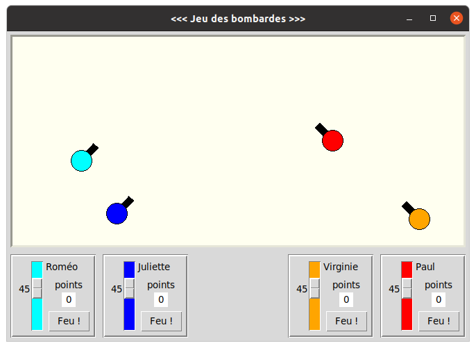
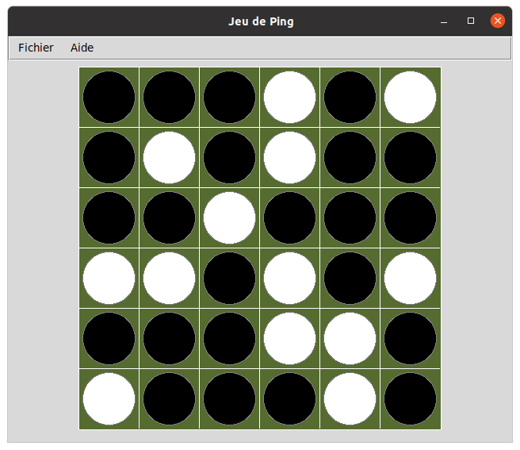

# Analyse de programmes concrets

Programmes issus de https://fr.wikibooks.org/wiki/Programmation_Python/Analyse_de_programmes_concrets

## Installation

Création d'un répertoire pour accueillir les sources:

```bash
$ mkdir wikilivre
$ cd wikilivre
```

Mise en place du système de gestion de version (git) pour ce répertoire:

```bash
<wikilivre>$ git init 
```

Environnement virtuel pour Python3:

```bash
$ sudo apt install python3-venv
<wikilivre>$ python3 -m venv .venv
```

Activation de l'environnement virtuel:

```bash
<wikilivre>$ source .venv/bin/activate
```

Installation de Python Tk (TKinter) pour faire marcher les exemples (sur Debian/Ubuntu):

```bash
$ sudo apt install python3-tk 
```

## Canons

Jeu des bombardes.

Changement pour adaptation pour Python3 et TKinter.

Démarrage du jeu:

```bash
(.venv) <wikilivre>$ python canon03.py
```

Capture d'écran du jeu:



## Ping

Jeu de Ping.

Changement pour adaptation pour Python3 et TKinter.

Démarrage du jeu:

```bash
(.venv) <wikilivre>$ python ping.py
```

Capture d'écran du jeu:



## Epilogue

Désactiver l'environnement virtuel Python:

```bash
(.venv) <wikilivre>$ deactivate
<wikilivre>$
```

## Références

* [Programmation Python](https://fr.wikibooks.org/wiki/Programmation_Python)
* [Interface Python pour Tcl/Tk](https://docs.python.org/fr/3/library/tkinter.html)
* [Git: gestion de versions](https://fr.wikibooks.org/wiki/Git)
* [Python: Création d'environnements virtuels](https://docs.python.org/fr/3/library/venv.html)
